# TradingAnalyst - Architecture Documentation

> **Version:** 1.0.0
> **Last Updated:** February 2026
> **Status:** Production-Ready POC (Paper Trading)

---

## Table of Contents

1. [Project Overview](#1-project-overview)
2. [System Architecture](#2-system-architecture)
3. [Technology Stack](#3-technology-stack)
4. [Backend Architecture](#4-backend-architecture)
5. [Configuration Management](#5-configuration-management)
6. [Database Layer](#6-database-layer)
7. [API Layer](#7-api-layer)
8. [Services Layer](#8-services-layer)
9. [Integration Layer](#9-integration-layer)
10. [Security Architecture](#10-security-architecture)
11. [Frontend Architecture](#11-frontend-architecture)
12. [Key Workflows & Use Cases](#12-key-workflows--use-cases)
13. [Testing Architecture](#13-testing-architecture)
14. [Logging & Observability](#14-logging--observability)
15. [Deployment & DevOps](#15-deployment--devops)
16. [Performance Considerations](#16-performance-considerations)
17. [Appendices](#17-appendices)

---

## 1. PROJECT OVERVIEW

### 1.1 Project Name & Purpose

**TradingAnalyst** is a paper-trading proof-of-concept application that combines technical analysis with AI-powered trading recommendations. The system scans configurable assets on a schedule, runs a multi-indicator trading strategy (200 MA + Bravo 9 + RSI + MACD), leverages OpenAI for confluence analysis, and can execute paper trades via the Alpaca brokerage API.

### 1.2 Business Context

The application serves as a sophisticated trading assistant for:
- **Automated Market Scanning**: Continuously monitors configured assets across multiple timeframes
- **Technical Analysis**: Computes multiple indicators to identify trading opportunities
- **AI-Enhanced Decision Making**: Uses OpenAI models to analyze confluence and provide trading recommendations
- **Paper Trading Execution**: Allows safe execution of trades in a simulated environment
- **Trade Tracking**: Records and analyzes trading performance with win/loss statistics

### 1.3 Key Features & Capabilities

| Feature | Description |
|---------|-------------|
| **Multi-Indicator Strategy** | 200 MA trend, Bravo 9 reversal, RSI momentum, MACD confirmation |
| **AI Analysis** | OpenAI integration for confluence analysis and momentum prediction |
| **Scheduled Scanning** | Cron-based automatic scans during market hours |
| **Asset Support** | Stocks (via Data API v2) and Crypto (via v1beta3 API) |
| **Bracket Orders** | Support for stop-loss and take-profit orders |
| **Real-time Progress** | Live scan progress tracking in the UI |
| **TradingView Integration** | Direct links to TradingView charts |

### 1.4 Target Users/Personas

| Persona | Description | Primary Use Case |
|---------|-------------|------------------|
| **Retail Trader** | Individual trader testing strategies | Strategy validation before live trading |
| **Algo Developer** | Developer building trading systems | POC for automated trading logic |
| **Trading Educator** | Teaching trading concepts | Demonstrating technical analysis |

### 1.5 Project Status & Versioning

- **Current Version**: 1.0.0
- **Status**: Feature-complete POC (all 5 phases done)
- **Trading Mode**: Paper trading only (live trading ready but disabled)
- **Branch**: main

### 1.6 Repository Structure

```
TradingAnalyst/
├── roadmap.md                    # Full development plan & progress
├── EFFICIENCY_REPORT.md          # Performance optimization report
├── ARCHITECTURE_DOCUMENTATION.md # This file
└── App/
    ├── README.md                 # Quick start guide
    ├── ARCHITECTURE.md           # Original architecture notes
    ├── Backend/                  # Node.js + Express REST API
    │   ├── package.json
    │   ├── .gitignore
    │   ├── .env.example
    │   ├── data/                 # SQLite database (gitignored)
    │   │   └── trading.db
    │   └── src/
    │       ├── index.js          # Application entry point
    │       ├── config/
    │       │   └── settings.js   # Settings management
    │       ├── db/
    │       │   └── init.js       # Database initialization
    │       ├── routes/
    │       │   ├── assets.js     # Asset search endpoints
    │       │   ├── scan.js       # Scan & execute endpoints
    │       │   ├── settings.js   # Settings CRUD endpoints
    │       │   └── trades.js     # Trade history endpoints
    │       └── services/
    │           ├── alpaca.js     # Alpaca API wrapper
    │           ├── openai.js     # OpenAI integration
    │           ├── scan.js       # Scan orchestrator
    │           ├── scheduler.js  # Cron scheduler
    │           └── strategy.js   # Technical indicators
    └── Frontend/                 # React + Vite admin panel
        ├── package.json
        ├── vite.config.js
        ├── index.html
        └── src/
            ├── main.jsx          # React entry point
            ├── App.jsx           # Router configuration
            ├── index.css         # Global styles
            ├── api/
            │   └── client.js     # Backend API client
            ├── components/
            │   ├── Layout.jsx    # App shell with navigation
            │   └── ExecuteModal.jsx # Trade execution modal
            ├── pages/
            │   ├── Dashboard.jsx # Main scanning interface
            │   ├── Settings.jsx  # Configuration page
            │   └── Trades.jsx    # Trade history & stats
            └── utils/
                └── tradingView.js # TradingView URL helper
```

### 1.7 High-Level Context Diagram


---

## 2. SYSTEM ARCHITECTURE

### 2.1 High-Level Architecture

#### Architectural Pattern

TradingAnalyst follows a **Two-Tier Modular Monolith** architecture:

- **Frontend Tier**: React SPA served by Vite dev server
- **Backend Tier**: Node.js/Express REST API with embedded SQLite

The architecture emphasizes:
- **Separation of Concerns**: Clear layering (Routes → Services → Data Access)
- **Single Responsibility**: Each service handles one domain
- **Loose Coupling**: Services communicate through well-defined interfaces

#### System Boundaries


#### Communication Patterns

| Pattern | Usage | Protocol |
|---------|-------|----------|
| **Synchronous REST** | Frontend ↔ Backend | HTTP/JSON |
| **Synchronous REST** | Backend → Alpaca | HTTPS/JSON |
| **Synchronous REST** | Backend → OpenAI | HTTPS/JSON |
| **Polling** | Scan progress updates | HTTP/JSON (500ms interval) |
| **Cron Scheduling** | Automatic scans | Internal (node-cron) |

### 2.2 C4 Container Diagram

```mermaid
graph TB
    subgraph "Users"
        Trader["👤 Trader<br/><i>Uses the admin panel</i>"]
    end

    subgraph "TradingAnalyst Containers"
        Frontend["🖥️ Frontend SPA<br/><b>React, Vite</b><br/><i>Admin panel for settings,<br/>scanning, and trade management</i>"]
        Backend["⚙️ Backend API<br/><b>Node.js, Express</b><br/><i>REST API handling business<br/>logic and data access</i>"]
        SQLite[("🗄️ SQLite Database<br/><b>better-sqlite3</b><br/><i>Stores settings,<br/>candidates, and trades</i>")]
    end

    subgraph "External Services"
        Alpaca["🏦 Alpaca API<br/><i>Market data and trading</i>"]
        OpenAI["🤖 OpenAI API<br/><i>AI analysis</i>"]
    end

    Trader -->|"Uses (HTTPS)"| Frontend
    Frontend -->|"Calls API (HTTP/REST)"| Backend
    Backend -->|"Reads/Writes (SQLite)"| SQLite
    Backend -->|"Fetches data, trades (HTTPS)"| Alpaca
    Backend -->|"Requests analysis (HTTPS)"| OpenAI
```



### 2.3 Component Diagram


### 2.4 Architecture Decision Records (ADRs)

#### ADR-001: Two-Tier Architecture

**Status**: Accepted

**Context**: Need a simple, maintainable architecture for a POC trading application.

**Decision**: Use a two-tier architecture with React frontend and Node.js backend.

**Rationale**:
- Simple to develop and deploy locally
- No infrastructure complexity
- Suitable for single-user POC
- Easy to extend to microservices if needed

**Trade-offs**:
- (+) Rapid development
- (+) Easy debugging
- (-) Limited scalability
- (-) Single point of failure

---

#### ADR-002: SQLite for Persistence

**Status**: Accepted

**Context**: Need lightweight, file-based storage for settings and trade data.

**Decision**: Use SQLite via better-sqlite3 for all persistence.

**Rationale**:
- Zero configuration required
- No external database server
- Fast synchronous API
- WAL mode for better concurrency
- Suitable for local single-user app

**Trade-offs**:
- (+) No infrastructure needed
- (+) Fast local access
- (-) No multi-user support
- (-) No replication/backup built-in

---

#### ADR-003: Session-Only Trade History

**Status**: Accepted

**Context**: Trade data should not persist between sessions for a POC.

**Decision**: Clear the trades table on every backend startup.

**Rationale**:
- Prevents confusion with stale paper trade data
- Each session starts fresh
- Simplifies testing and development
- Users expect clean slate in POC mode

**Trade-offs**:
- (+) Clean state each session
- (+) No stale data confusion
- (-) No historical analysis across sessions
- (-) Users must export data manually if needed

---

#### ADR-004: Pre-qualification Gate for OpenAI

**Status**: Accepted

**Context**: OpenAI API calls are expensive; not every asset needs AI analysis.

**Decision**: Implement `isWorthSendingToOpenAI()` to filter candidates before AI analysis.

**Rationale**:
- Reduces API costs significantly
- Focuses AI on high-probability setups
- Strong Bravo 9 or trend+momentum confluence required

**Trade-offs**:
- (+) Lower API costs
- (+) Faster scans
- (-) May miss edge-case opportunities
- (-) Requires tuning of pre-qualification logic

---

#### ADR-005: Crypto Data, Stock Execution Only

**Status**: Accepted

**Context**: Alpaca supports both crypto and stock trading, but with different APIs.

**Decision**: Support crypto symbols for data/scanning but only execute stock orders.

**Rationale**:
- Crypto data API (v1beta3) is different from stocks (v2)
- Crypto execution has different requirements
- Simplifies order handling for POC
- Users can still analyze crypto without execution risk

**Trade-offs**:
- (+) Simpler order logic
- (+) Consistent execution behavior
- (-) Cannot paper trade crypto
- (-) Feature limitation for crypto traders

---

## 3. TECHNOLOGY STACK

### 3.1 Complete Stack Inventory

| Layer | Technology | Version | Purpose |
|-------|------------|---------|---------|
| **Frontend Framework** | React | 18.3.1 | UI component library |
| **Frontend Router** | React Router DOM | 6.28.0 | Client-side routing |
| **Build Tool** | Vite | 5.4.10 | Fast dev server and bundler |
| **React Plugin** | @vitejs/plugin-react | 4.3.3 | React Fast Refresh support |
| **Backend Runtime** | Node.js | 18+ | JavaScript runtime |
| **Backend Framework** | Express | 4.21.1 | HTTP server framework |
| **Database** | SQLite | (embedded) | Lightweight SQL database |
| **SQLite Driver** | better-sqlite3 | 11.6.0 | Synchronous SQLite bindings |
| **Scheduler** | node-cron | 3.0.3 | Cron-based task scheduling |
| **Environment** | dotenv | 16.4.5 | Environment variable loading |
| **CORS** | cors | 2.8.5 | Cross-origin resource sharing |
| **Market Data API** | Alpaca Trade API | 3.0.4 | Stock/crypto data and trading |
| **AI Integration** | OpenAI | 4.73.0 | GPT models for analysis |
| **Styling** | Custom CSS | - | Dark theme with CSS variables |
| **Font** | DM Sans | (Google Fonts) | UI typography |

### 3.2 Technology Stack Visualization

```mermaid
graph TB
    subgraph "Presentation Layer"
        React[React 18.3]
        ReactRouter[React Router 6.28]
        CSS[Custom CSS Dark Theme]
    end

    subgraph "Build & Dev Tools"
        Vite[Vite 5.4]
        ViteReact[@vitejs/plugin-react]
    end

    subgraph "API Layer"
        Express[Express 4.21]
        CORS[CORS Middleware]
    end

    subgraph "Business Logic"
        NodeCron[node-cron 3.0]
        Strategy[Technical Indicators]
    end

    subgraph "External Integrations"
        Alpaca[Alpaca SDK 3.0]
        OpenAI[OpenAI SDK 4.73]
    end

    subgraph "Data Layer"
        SQLite[SQLite]
        BetterSQLite[better-sqlite3 11.6]
    end

    subgraph "Configuration"
        Dotenv[dotenv 16.4]
        EnvVars[Environment Variables]
    end

    React --> Vite
    ReactRouter --> React
    CSS --> React
    Vite --> ViteReact

    Express --> CORS
    Express --> NodeCron
    Express --> Strategy

    NodeCron --> Alpaca
    Strategy --> Alpaca
    Strategy --> OpenAI

    Express --> BetterSQLite
    BetterSQLite --> SQLite

    Dotenv --> EnvVars
    EnvVars --> Express
```

---

## 4. BACKEND ARCHITECTURE

### 4.1 Application Entry Point

**File**: `App/Backend/src/index.js`

The application bootstrap process:

```javascript
// 1. Load environment variables
import 'dotenv/config';

// 2. Initialize Express app
const app = express();
const PORT = process.env.PORT || 3001;

// 3. Configure middleware
app.use(cors());
app.use(express.json());

// 4. Initialize database
initDb();

// 5. Start scheduler
startScheduler();

// 6. Mount route handlers
app.use('/api/settings', settingsRouter);
app.use('/api/trades', tradesRouter);
app.use('/api/scan', scanRouter);
app.use('/api/assets', assetsRouter);

// 7. Health check endpoint
app.get('/api/health', (req, res) => res.json({ ok: true }));

// 8. Global error handler
app.use((err, req, res, next) => {
  console.error(err);
  res.status(500).json({ error: err.message || 'Internal server error' });
});

// 9. Start listening
app.listen(PORT);
```

### 4.2 Application Startup Sequence


### 4.3 Server Configuration

| Configuration | Value | Source |
|---------------|-------|--------|
| **Port** | 3001 (default) | `PORT` env var |
| **CORS** | Enabled (all origins) | `cors()` middleware |
| **JSON Body Parser** | Enabled | `express.json()` |
| **Database Mode** | WAL (Write-Ahead Logging) | SQLite pragma |

### 4.4 Package/Module Structure


### 4.5 Layer Responsibilities

| Layer | Files | Responsibility |
|-------|-------|----------------|
| **Routes** | `routes/*.js` | HTTP request handling, input validation, response formatting |
| **Services** | `services/*.js` | Business logic, external API integration, data transformation |
| **Config** | `config/settings.js` | Settings read/write, defaults, validation |
| **DB** | `db/init.js` | Database initialization, schema management, migrations |

---

## 5. CONFIGURATION MANAGEMENT

### 5.1 Configuration Sources

#### Environment Variables (`.env`)

| Variable | Description | Default |
|----------|-------------|---------|
| `ALPACA_API_KEY` | Alpaca API key | Required |
| `ALPACA_SECRET_KEY` | Alpaca secret key | Required |
| `ALPACA_PAPER` | Use paper trading | `true` |
| `OPENAI_API_KEY` | OpenAI API key | Required |
| `PORT` | Backend server port | `3001` |
| `ALPACA_DATA_DELAY_MS` | Delay between Alpaca API calls | `500` |

#### Database Settings (SQLite)

Settings are stored as key-value pairs in the `settings` table:

```javascript
const DEFAULTS = {
  assets: ['AAPL', 'MSFT', 'SPY'],
  timeframes: ['1Day', '1Hour'],
  schedulerEnabled: true,
  scanFrequencyCron: '*/15 * * * *',
  strategy: {
    maPeriods: [20, 50, 200],
    rsiPeriod: 14,
    rsiOversold: 30,
    rsiOverbought: 70,
  },
  openai: {
    model: 'gpt-4o-mini',
    logResponsesToConsole: true,
    systemPrompt: '...',  // Trading context prompt
  },
};
```

### 5.2 Configuration Hierarchy


### 5.3 Valid Timeframes

```javascript
const VALID_TIMEFRAMES = [
  '1Min', '5Min', '15Min', '30Min',
  '1Hour', '2Hour', '4Hour', '6Hour',
  '1Day', '1Week', '1Month'
];
```

### 5.4 Settings Validation

- **Assets**: Must match regex `/^[A-Z0-9./]{1,20}$/` (supports crypto like ETH/USD)
- **Timeframes**: Normalized and validated against allowed list
- **MA Periods**: Array of positive integers
- **Cron Expression**: Validated by node-cron before scheduling

---

## 6. DATABASE LAYER

### 6.1 Database Architecture

- **Type**: SQLite (embedded)
- **Driver**: better-sqlite3 (synchronous API)
- **Location**: `App/Backend/data/trading.db`
- **Mode**: WAL (Write-Ahead Logging) for better concurrency

### 6.2 Entity Relationship Diagram


### 6.3 Table Definitions

#### Settings Table

```sql
CREATE TABLE IF NOT EXISTS settings (
  key TEXT PRIMARY KEY,
  value TEXT NOT NULL
);
```

#### Trades Table

```sql
CREATE TABLE IF NOT EXISTS trades (
  id INTEGER PRIMARY KEY AUTOINCREMENT,
  symbol TEXT NOT NULL,
  side TEXT NOT NULL,
  quantity REAL NOT NULL,
  entry_price REAL,
  entry_time TEXT,
  stop_loss REAL,
  take_profit REAL,
  exit_price REAL,
  exit_time TEXT,
  exit_reason TEXT,
  pnl REAL,
  alpaca_order_id TEXT,
  timeframe TEXT,
  created_at TEXT DEFAULT (datetime('now'))
);
```

#### Candidates Table

```sql
CREATE TABLE IF NOT EXISTS candidates (
  id INTEGER PRIMARY KEY AUTOINCREMENT,
  symbol TEXT NOT NULL,
  timeframe TEXT NOT NULL,
  side TEXT NOT NULL,
  confidence REAL,
  suggested_size REAL,
  stop_loss REAL,
  take_profit REAL,
  raw_response TEXT,
  rsi REAL,
  bravo9_signal TEXT,
  bravo9 TEXT,
  current_price REAL,
  trend_signal TEXT,
  trend_200 TEXT,
  macd_signal TEXT,
  momentum_prediction TEXT,
  scanned_at TEXT DEFAULT (datetime('now'))
);
```

### 6.4 Database Migration Strategy

Migrations are handled inline during `initDb()`:

```javascript
const migrations = [
  ['rsi', 'REAL'],
  ['bravo9_signal', 'TEXT'],
  ['bravo9', 'TEXT'],
  ['current_price', 'REAL'],
  ['trend_signal', 'TEXT'],
  ['trend_200', 'TEXT'],
  ['macd_signal', 'TEXT'],
  ['momentum_prediction', 'TEXT'],
];

// Check existing columns
const existingCols = new Set(
  database.prepare('PRAGMA table_info(candidates)').all().map(r => r.name)
);

// Add missing columns
for (const [col, type] of migrations) {
  if (!existingCols.has(col)) {
    database.exec(`ALTER TABLE candidates ADD COLUMN ${col} ${type}`);
  }
}
```

### 6.5 Session-Only Trade Data

Trade history is intentionally cleared on each backend startup:

```javascript
// Clear trades on startup so the app only shows trades from this session
database.prepare('DELETE FROM trades').run();
```

---

## 7. API LAYER

### 7.1 API Design

- **Style**: RESTful JSON API
- **Base URL**: `/api`
- **Authentication**: None (local-only POC)
- **Versioning**: None (single version)

### 7.2 Complete API Reference


### 7.3 Endpoint Details

#### Settings Endpoints

| Method | Path | Purpose | Request | Response |
|--------|------|---------|---------|----------|
| `GET` | `/api/settings` | Get all settings | - | `{ assets, timeframes, schedulerEnabled, scanFrequencyCron, strategy, openai }` |
| `PUT` | `/api/settings` | Update settings | Partial settings object | Updated settings |
| `GET` | `/api/settings/openai-models` | List OpenAI models | - | `{ models: [{ id, created, owned_by }] }` |

#### Scan Endpoints

| Method | Path | Purpose | Request | Response |
|--------|------|---------|---------|----------|
| `POST` | `/api/scan/run` | Trigger scan | `?indicatorOnly=true/false` | `{ candidates, scannedAt }` or `{ indicatorsOnly, scannedAt }` |
| `GET` | `/api/scan/progress` | Get scan progress | - | `{ running, indicatorOnly, current, total, symbol, timeframe }` |
| `GET` | `/api/scan/candidates` | Get latest candidates | - | `{ candidates: [], lastScannedAt }` |
| `POST` | `/api/scan/execute` | Execute trade | `{ symbol, side, quantity, orderType, limitPrice, stopLoss, takeProfit, timeframe }` | `{ order, trade }` |

#### Trades Endpoints

| Method | Path | Purpose | Request | Response |
|--------|------|---------|---------|----------|
| `GET` | `/api/trades` | List trades | `?symbol=X&limit=100` | `[{ id, symbol, side, ... }]` |
| `GET` | `/api/trades/stats` | Get statistics | - | `{ totalTrades, wins, losses, winRate, totalPnl, avgWin, avgLoss }` |
| `POST` | `/api/trades` | Log trade manually | Trade object | Created trade |
| `PATCH` | `/api/trades/:id` | Update trade | `{ exit_price, exit_time, exit_reason, pnl }` | Updated trade |

#### Assets Endpoints

| Method | Path | Purpose | Request | Response |
|--------|------|---------|---------|----------|
| `GET` | `/api/assets/search` | Search assets | `?q=query` | `[{ symbol, name, asset_class }]` |

#### Health Endpoint

| Method | Path | Purpose | Response |
|--------|------|---------|----------|
| `GET` | `/api/health` | Health check | `{ ok: true }` |

### 7.4 Request/Response Flow


### 7.5 Error Handling

All errors follow a consistent format:

```json
{
  "error": "Error message describing what went wrong",
  "details": { /* Optional additional context */ }
}
```

Error responses by status:

| Status | Meaning | Example |
|--------|---------|---------|
| `400` | Bad Request | Missing required fields |
| `404` | Not Found | Trade ID not found |
| `422` | Unprocessable | Invalid Alpaca order |
| `500` | Server Error | Unexpected exception |
| `502` | Bad Gateway | Alpaca API error |

---

## 8. SERVICES LAYER

### 8.1 Service Architecture


### 8.2 Service Descriptions

#### alpaca.js - Market Data & Trading Service

**Purpose**: Wraps all Alpaca API interactions.

**Key Functions**:

| Function | Purpose | Returns |
|----------|---------|---------|
| `getBars(symbol, timeframe, opts)` | Fetch OHLCV bars | `[{ t, o, h, l, c, v }]` |
| `getLatestTradePrice(symbol)` | Get current price | `number \| null` |
| `placeStockOrder(params)` | Execute trade | Order object |
| `getClock()` | Check market status | Clock object |
| `searchAssets(query)` | Search assets | `[{ symbol, name, asset_class }]` |

**Features**:
- Routes stocks (Data API v2) vs crypto (v1beta3) based on symbol
- 429 retry logic with exponential backoff
- Asset caching (24-hour TTL)
- Bracket order support (SL/TP)

#### strategy.js - Technical Indicators Service

**Purpose**: Pure computation of technical indicators.

**Key Functions**:

| Function | Purpose | Returns |
|----------|---------|---------|
| `computeMA(bars, period)` | Simple Moving Average | `number \| null` |
| `computeEMA(bars, period)` | Exponential Moving Average | `number \| null` |
| `computeMACD(bars, fast, slow, signal)` | MACD indicator | `{ macdLine, signalLine, histogram, signal }` |
| `computeRSI(bars, period)` | Relative Strength Index | `{ rsi, oversold, overbought }` |
| `computeBravo9(bars)` | Bravo 9 reversal signal | `{ signal, ema9, ema20, sma180, ... }` |
| `computeTrendFrom200(bars)` | 200 MA trend | `{ ma200, above, trend }` |
| `computeIndicators(bars, strategy)` | All indicators | Combined indicator object |
| `isWorthSendingToOpenAI(indicators)` | Pre-qualification gate | `boolean` |

**Indicator Logic**:


#### openai.js - AI Analysis Service

**Purpose**: Integrates with OpenAI for trading recommendations.

**Key Functions**:

| Function | Purpose | Returns |
|----------|---------|---------|
| `buildAnalysisPrompt(bars, indicators, symbol, timeframe, price)` | Build prompt message | Message object |
| `getRecommendation(bars, indicators, symbol, timeframe, config, price)` | Get AI recommendation | `{ recommendation, confidence, momentumPrediction, stopLoss, takeProfit, reasoning }` |

**Prompt Structure**:
1. Trading Summary (symbol, timeframe, entry, trend, RSI, MACD, Bravo 9)
2. Full Indicators (raw JSON)
3. Recent OHLCV Bars (last 30)
4. Strategy Context (how to interpret signals)
5. Instructions (what to output)

**Rate Limiting**: 429 retry with 3-second exponential backoff.

#### scan.js - Scan Orchestrator Service

**Purpose**: Coordinates the scanning workflow.

**Key Functions**:

| Function | Purpose | Returns |
|----------|---------|---------|
| `runScan(settings, opts)` | Execute full scan | `{ candidates, scannedAt }` |
| `getScanProgress()` | Get current progress | `{ running, current, total, symbol, timeframe }` |

**Scan Flow**:


#### scheduler.js - Cron Scheduler Service

**Purpose**: Manages automatic scanning schedule.

**Key Functions**:

| Function | Purpose |
|----------|---------|
| `startScheduler()` | Initialize/update cron job |
| `stopScheduler()` | Stop cron job |

**Behavior**:
- Reads cron expression from settings
- Validates expression before scheduling
- Checks market clock before running scan
- Skips scan if market is closed

### 8.3 Transaction Management

SQLite operations are synchronous via better-sqlite3. No explicit transaction management is needed for single operations. For batch operations, the scan service uses sequential inserts within a single execution context.

### 8.4 Domain Model


---

## 9. INTEGRATION LAYER

### 9.1 External Service Integrations


### 9.2 Alpaca Integration Details

**Base URLs**:
- Data: `https://data.alpaca.markets`
- Paper Trading: `https://paper-api.alpaca.markets`
- Live Trading: `https://api.alpaca.markets`

**Authentication**: API key headers
```javascript
{
  'APCA-API-KEY-ID': process.env.ALPACA_API_KEY,
  'APCA-API-SECRET-KEY': process.env.ALPACA_SECRET_KEY,
}
```

**Rate Limiting**: 429 retry with Retry-After header or 65s default.

**Data Endpoints Used**:
- `GET /v2/stocks/{symbol}/bars` - Stock bars
- `GET /v2/stocks/{symbol}/trades/latest` - Latest trade price
- `GET /v1beta3/crypto/us/bars` - Crypto bars

**Trading Endpoints Used**:
- `POST /v2/orders` - Create order (via SDK)
- `GET /v2/clock` - Market clock
- `GET /v2/assets` - Asset list

### 9.3 OpenAI Integration Details

**Base URL**: `https://api.openai.com`

**Authentication**: Bearer token
```javascript
Authorization: `Bearer ${process.env.OPENAI_API_KEY}`
```

**Endpoints Used**:
- `POST /v1/chat/completions` - Get recommendations
- `GET /v1/models` - List available models

**Rate Limiting**: 3 retries with 3s/6s/9s backoff.

### 9.4 Scheduling

**Scheduler**: node-cron

**Default Schedule**: `*/15 * * * *` (every 15 minutes)

**Market-Aware**: Skips scan when market is closed (checked via Alpaca clock).


---

## 10. SECURITY ARCHITECTURE

### 10.1 Security Design

**Authentication**: None (local-only POC)

**Authorization**: None (single user)

**Network**: Localhost only

### 10.2 Credential Management

All sensitive credentials are stored in environment variables:

| Credential | Storage | Access |
|------------|---------|--------|
| `ALPACA_API_KEY` | `.env` file | Backend only |
| `ALPACA_SECRET_KEY` | `.env` file | Backend only |
| `OPENAI_API_KEY` | `.env` file | Backend only |

**Security Rules**:
- `.env` file is in `.gitignore`
- Keys never sent to frontend
- Keys never logged

### 10.3 Security Boundaries


### 10.4 Input Validation

- **Asset symbols**: Regex validated `/^[A-Z0-9./]{1,20}$/`
- **Timeframes**: Validated against allowed list
- **Order quantities**: Must be positive integers
- **Take profit**: Validated for side (above/below entry)

### 10.5 Future Security Considerations

For production deployment:
- Add authentication (JWT, OAuth)
- Enable HTTPS
- Add rate limiting
- Implement audit logging
- Add CSRF protection
- Encrypt database

---

## 11. FRONTEND ARCHITECTURE

### 11.1 Frontend Overview

| Aspect | Technology |
|--------|------------|
| **Framework** | React 18.3 |
| **Router** | React Router DOM 6.28 |
| **State** | React hooks (useState, useCallback, useMemo, useEffect) |
| **Build** | Vite 5.4 |
| **Styling** | Custom CSS with CSS variables |
| **Font** | DM Sans (Google Fonts) |

### 11.2 Project Structure

```
Frontend/src/
├── main.jsx          # React DOM render
├── App.jsx           # Router configuration
├── index.css         # Global styles & theme
├── api/
│   └── client.js     # Backend API wrapper
├── components/
│   ├── Layout.jsx    # App shell with sidebar
│   └── ExecuteModal.jsx # Trade execution dialog
├── pages/
│   ├── Dashboard.jsx # Main scanning interface
│   ├── Settings.jsx  # Configuration form
│   └── Trades.jsx    # Trade history & stats
└── utils/
    └── tradingView.js # TradingView URL helper
```

### 11.3 Component Architecture


### 11.4 Pages & Routing

| Route | Page | Purpose |
|-------|------|---------|
| `/` | Dashboard | Main scanning interface, candidates table, execute trades |
| `/settings` | Settings | Configure assets, timeframes, strategy, OpenAI |
| `/trades` | Trades | View trade history and performance statistics |

```mermaid
graph LR
    subgraph "Navigation"
        Nav[Sidebar Navigation]
        Nav --> D[/ Dashboard]
        Nav --> S[/settings]
        Nav --> T[/trades]
    end

    D --> |Run Scan| Candidates[Candidates Table]
    D --> |Execute| Modal[Execute Modal]
    D --> |View Chart| TV[TradingView]

    S --> |Save| API[Backend API]

    T --> |Load| API
```

### 11.5 State Management

The application uses React's built-in hooks for state management:

```mermaid
graph TB
    subgraph "Dashboard State"
        candidates[candidates: Candidate[]]
        trades[trades: Trade[]]
        loading[loading: boolean]
        error[error: string | null]
        scanProgress[scanProgress: Progress | null]
        indicatorsOnly[indicatorsOnly: Indicator[] | null]
        executeCandidate[executeCandidate: Candidate | null]
        sortState[Sort: column, direction]
        filterState[Filters: symbol, tf, trend, etc.]
    end

    subgraph "Settings State"
        settings[settings: Settings | null]
        openaiModels[openaiModels: Model[]]
        searchResults[searchResults: Asset[]]
    end

    subgraph "Trades State"
        tradesList[trades: Trade[]]
        stats[stats: Stats | null]
    end
```

### 11.6 API Client Layer

**File**: `src/api/client.js`

Thin fetch wrapper for all backend endpoints:

| Function | Endpoint | Method |
|----------|----------|--------|
| `getSettings()` | `/api/settings` | GET |
| `updateSettings(body)` | `/api/settings` | PUT |
| `getOpenAIModels()` | `/api/settings/openai-models` | GET |
| `searchAssets(query)` | `/api/assets/search` | GET |
| `runScan(opts)` | `/api/scan/run` | POST |
| `getScanProgress()` | `/api/scan/progress` | GET |
| `getCandidates()` | `/api/scan/candidates` | GET |
| `executeTrade(payload)` | `/api/scan/execute` | POST |
| `getTrades(params)` | `/api/trades` | GET |
| `getTradeStats()` | `/api/trades/stats` | GET |

### 11.7 Styling Architecture

**Methodology**: Custom CSS with CSS Variables (dark theme)

**Theme Variables**:

```css
:root {
  /* Backgrounds */
  --bg-app: #0c0c0f;
  --bg-sidebar: #111113;
  --bg-card: #161619;
  --bg-elevated: #1c1c1f;
  --bg-input: #1e1e22;

  /* Borders */
  --border-subtle: #252528;
  --border-default: #2d2d32;

  /* Text */
  --text-primary: #f4f4f5;
  --text-secondary: #a1a1aa;
  --text-muted: #71717a;

  /* Accent & Semantic */
  --accent: #6366f1;
  --success: #22c55e;
  --danger: #ef4444;

  /* Layout */
  --sidebar-width: 220px;
  --radius-md: 8px;
}
```

**Responsive Design**:
- Settings grid switches to single column at 900px
- Tables have horizontal scroll on overflow

### 11.8 Component Hierarchy

```mermaid
graph TB
    App[App]
    App --> Layout

    Layout --> Sidebar[Sidebar]
    Layout --> Main[Main Content]

    Sidebar --> Brand[Brand Logo]
    Sidebar --> Nav[Navigation Links]

    Main --> Dashboard
    Main --> Settings
    Main --> Trades

    Dashboard --> ScanButtons[Scan Buttons]
    Dashboard --> ProgressBar[Progress Bar]
    Dashboard --> CandidatesTable[Candidates Table]
    Dashboard --> IndicatorsTable[Indicators Table]
    Dashboard --> ExecuteModal

    Settings --> AssetsSection[Assets Section]
    Settings --> TimeframesSection[Timeframes]
    Settings --> CronSection[Cron Schedule]
    Settings --> StrategySection[Strategy Params]
    Settings --> OpenAISection[OpenAI Config]

    Trades --> StatsGrid[Statistics Grid]
    Trades --> TradesTable[Trades Table]
```

---

## 12. KEY WORKFLOWS & USE CASES

### 12.1 Full Scan Workflow

**Actors**: Trader, System

**Preconditions**:
- Backend running
- Alpaca/OpenAI keys configured
- At least one asset configured

**Flow**:

```mermaid
sequenceDiagram
    actor Trader
    participant Dashboard
    participant Backend
    participant Alpaca
    participant Strategy
    participant OpenAI
    participant DB

    Trader->>Dashboard: Click "Run scan now"
    Dashboard->>Backend: POST /api/scan/run

    loop For each asset
        Backend->>Alpaca: getLatestTradePrice()
        Alpaca-->>Backend: Current price

        loop For each timeframe
            Dashboard->>Backend: GET /api/scan/progress
            Backend-->>Dashboard: Progress update
            Dashboard->>Dashboard: Update progress bar

            Backend->>Alpaca: getBars()
            Alpaca-->>Backend: OHLCV bars

            Backend->>Strategy: computeIndicators()
            Strategy-->>Backend: All indicators

            Backend->>Strategy: isWorthSendingToOpenAI()
            Strategy-->>Backend: true/false

            alt Worth sending
                Backend->>OpenAI: getRecommendation()
                OpenAI-->>Backend: { recommendation, confidence, ... }

                alt recommendation != 'none'
                    Backend->>DB: INSERT candidate
                end
            end
        end
    end

    Backend-->>Dashboard: { candidates, scannedAt }
    Dashboard->>Dashboard: Render candidates table
    Trader->>Trader: Review candidates
```

### 12.2 Trade Execution Workflow

**Actors**: Trader

**Preconditions**:
- Candidate exists from scan
- Valid entry price available

**Flow**:

```mermaid
sequenceDiagram
    actor Trader
    participant Dashboard
    participant Modal
    participant Backend
    participant Alpaca
    participant DB

    Trader->>Dashboard: Click "Execute" on candidate
    Dashboard->>Modal: Open ExecuteModal
    Modal->>Modal: Pre-fill from candidate

    Trader->>Modal: Adjust qty, SL/TP
    Trader->>Modal: Select order type

    alt Limit order
        Trader->>Modal: Enter limit price
    end

    Modal->>Modal: Validate TP vs entry

    Trader->>Modal: Click "Place order"
    Modal->>Backend: POST /api/scan/execute

    Backend->>Backend: Validate inputs
    Backend->>Backend: Check if crypto (reject)
    Backend->>Backend: Validate TP direction

    Backend->>Alpaca: placeStockOrder()
    Alpaca-->>Backend: Order response

    Backend->>DB: INSERT trade
    Backend-->>Modal: { order, trade }

    Modal->>Dashboard: Close modal
    Dashboard->>Backend: GET /api/trades
    Dashboard->>Dashboard: Highlight executed row
```

### 12.3 Scheduled Scan Workflow

**Actors**: System (Cron)

**Flow**:

```mermaid
sequenceDiagram
    participant Cron as node-cron
    participant Scheduler
    participant Alpaca
    participant Scan

    Cron->>Scheduler: Trigger (cron expression)
    Scheduler->>Scheduler: Check schedulerEnabled

    alt Disabled
        Scheduler->>Scheduler: Skip
    else Enabled
        Scheduler->>Alpaca: getClock()
        Alpaca-->>Scheduler: { is_open: boolean }

        alt Market closed
            Scheduler->>Scheduler: Log "skipping"
        else Market open
            Scheduler->>Scan: runScan()
            Scan-->>Scheduler: Results
            Scheduler->>Scheduler: Log "done"
        end
    end
```

### 12.4 Data Flow Diagram

```mermaid
flowchart LR
    subgraph "Data Sources"
        Alpaca[(Alpaca API)]
        OpenAI[(OpenAI API)]
    end

    subgraph "Processing"
        Bars[OHLCV Bars]
        Indicators[Technical Indicators]
        Analysis[AI Analysis]
    end

    subgraph "Storage"
        Settings[(Settings Table)]
        Candidates[(Candidates Table)]
        Trades[(Trades Table)]
    end

    subgraph "Presentation"
        Dashboard[Dashboard UI]
        TradesPage[Trades UI]
        SettingsPage[Settings UI]
    end

    Alpaca --> Bars
    Bars --> Indicators
    Indicators --> Analysis
    OpenAI --> Analysis
    Analysis --> Candidates

    Settings --> Indicators
    Candidates --> Dashboard
    Trades --> Dashboard
    Trades --> TradesPage
    Settings --> SettingsPage
```

---

## 13. TESTING ARCHITECTURE

### 13.1 Testing Strategy

> **Note**: The current POC does not include automated tests. This section documents the recommended testing approach for production.

**Recommended Test Pyramid**:

```mermaid
graph TB
    subgraph "Test Pyramid"
        E2E[E2E Tests<br/>~10%]
        Integration[Integration Tests<br/>~30%]
        Unit[Unit Tests<br/>~60%]
    end

    E2E --> Integration
    Integration --> Unit
```

### 13.2 Recommended Test Structure

```
App/Backend/
├── __tests__/
│   ├── unit/
│   │   ├── services/
│   │   │   ├── strategy.test.js    # Indicator calculations
│   │   │   └── openai.test.js      # Prompt building
│   │   └── config/
│   │       └── settings.test.js    # Settings validation
│   ├── integration/
│   │   ├── routes/
│   │   │   ├── scan.test.js        # Scan endpoints
│   │   │   └── trades.test.js      # Trade endpoints
│   │   └── services/
│   │       └── scan.test.js        # Scan orchestration
│   └── e2e/
│       └── workflow.test.js        # Full scan-to-trade flow

App/Frontend/
├── __tests__/
│   ├── components/
│   │   └── ExecuteModal.test.jsx   # Modal validation
│   └── pages/
│       └── Dashboard.test.jsx      # Dashboard rendering
```

### 13.3 Testing Priorities

| Component | Priority | Reason |
|-----------|----------|--------|
| `strategy.js` | High | Pure functions, easy to test, critical for trading |
| `openai.js` prompt building | High | Ensures AI receives correct data |
| Scan workflow | High | Core business logic |
| Settings validation | Medium | Prevents configuration errors |
| UI components | Medium | User-facing functionality |

---

## 14. LOGGING & OBSERVABILITY

### 14.1 Logging

**Current Implementation**: Console logging only

**Log Categories**:

| Category | Example | Level |
|----------|---------|-------|
| Server startup | `Backend running at...` | Info |
| Scheduler events | `Scheduler started with cron:` | Info |
| Scan progress | `Running scheduled scan...` | Info |
| OpenAI requests | `[OpenAI] Request...` | Debug |
| OpenAI responses | `[OpenAI] Response...` | Debug |
| Errors | `Scan error ${symbol}:` | Error |
| Market status | `Market closed, skipping...` | Info |

**Configuration**:
- OpenAI logging controlled by `openai.logResponsesToConsole` setting

### 14.2 Observability Gaps

For production, consider adding:
- Structured JSON logging
- Log aggregation (ELK, Datadog)
- Distributed tracing
- Performance metrics
- Error tracking (Sentry)

### 14.3 Health Check

**Endpoint**: `GET /api/health`

**Response**: `{ "ok": true }`

**Usage**: Basic liveness check for monitoring.

---

## 15. DEPLOYMENT & DEVOPS

### 15.1 Local Development Setup

**Backend**:
```bash
cd App/Backend
cp .env.example .env
# Edit .env with API keys
npm install
npm start           # or npm run dev for watch mode
```

**Frontend**:
```bash
cd App/Frontend
npm install
npm run dev
```

### 15.2 Build Process

**Frontend Production Build**:
```bash
cd App/Frontend
npm run build      # Output to dist/
npm run preview    # Preview production build
```

**Backend**: No build step required (runs directly with Node.js)

### 15.3 Development Architecture

```mermaid
graph TB
    subgraph "Development Environment"
        ViteDev[Vite Dev Server<br/>:5173]
        Backend[Node.js/Express<br/>:3001]
        SQLite[(SQLite DB<br/>data/trading.db)]
    end

    ViteDev -->|Proxy /api/*| Backend
    Backend --> SQLite

    subgraph "External Services"
        Alpaca[Alpaca API]
        OpenAI[OpenAI API]
    end

    Backend --> Alpaca
    Backend --> OpenAI
```

### 15.4 Environment Configuration

| Environment | Frontend Port | Backend Port | Database |
|-------------|---------------|--------------|----------|
| Development | 5173 | 3001 | SQLite (local) |
| Production | 80/443 | 3001 | SQLite (local) |

### 15.5 Future Deployment Options

```mermaid
graph TB
    subgraph "Option 1: Single Server"
        Nginx1[Nginx] --> Static[Static Files]
        Nginx1 --> PM2[PM2/Node]
        PM2 --> SQLite1[(SQLite)]
    end

    subgraph "Option 2: Containerized"
        LB[Load Balancer]
        LB --> FE[Frontend Container]
        LB --> BE[Backend Container]
        BE --> SQLite2[(SQLite Volume)]
    end

    subgraph "Option 3: Cloud Native"
        CDN[CDN/S3] --> StaticS3[Static Assets]
        APIGW[API Gateway] --> Lambda[Lambda/Cloud Run]
        Lambda --> RDS[(RDS/Cloud SQL)]
    end
```

---

## 16. PERFORMANCE CONSIDERATIONS

### 16.1 Known Performance Issues

Documented in `EFFICIENCY_REPORT.md`:

| Issue | Location | Impact | Status |
|-------|----------|--------|--------|
| Redundant EMA in MACD | `strategy.js:42-69` | 2 extra array passes | Fixed |
| Multiple iterations in stats | `trades.js:22-43` | 6x iteration | Identified |
| Redundant EMA9 in Bravo9 | `strategy.js:113-138` | 1 extra pass | Identified |
| Duplicate 200 MA | `strategy.js:184-205` | Redundant sum | Fixed |
| Redundant startsWith | `alpaca.js:269-274` | Minor | Identified |

### 16.2 Rate Limiting Strategies

**Alpaca**:
- 500ms delay between data calls (`ALPACA_DATA_DELAY_MS`)
- 429 retry with exponential backoff

**OpenAI**:
- 1.5s delay between recommendations
- 3 retries with 3s/6s/9s backoff

### 16.3 Caching

| Data | Cache Duration | Location |
|------|----------------|----------|
| Alpaca assets | 24 hours | Memory |
| Settings | None (always fresh) | SQLite |
| Candidates | Until next scan | SQLite |

### 16.4 Scalability Limitations

- **Single user**: No multi-user support
- **Single process**: No horizontal scaling
- **Synchronous DB**: Better-sqlite3 blocks event loop
- **Memory caching**: Lost on restart

### 16.5 Recommended Optimizations

1. Batch indicator computations to share intermediate results
2. Implement single-pass statistics calculation
3. Add Redis for distributed caching
4. Use async database operations for heavy loads

---

## 17. APPENDICES

### A. Glossary

| Term | Definition |
|------|------------|
| **200 MA** | 200-period Moving Average, used for trend direction |
| **Bravo 9** | EMA9/EMA20/SMA180 alignment indicator for reversal signals |
| **RSI** | Relative Strength Index, momentum oscillator (0-100) |
| **MACD** | Moving Average Convergence Divergence indicator |
| **Confluence** | Alignment of multiple indicators in the same direction |
| **Paper Trading** | Simulated trading with fake money |
| **Bracket Order** | Order with attached stop-loss and take-profit |
| **Pre-qualification** | Filter to determine if AI analysis is worthwhile |

### B. References

- [Alpaca Documentation](https://alpaca.markets/docs/)
- [OpenAI API Reference](https://platform.openai.com/docs/)
- [React Documentation](https://react.dev/)
- [Vite Documentation](https://vitejs.dev/)
- [better-sqlite3 Documentation](https://github.com/WiseLibs/better-sqlite3)
- [node-cron Documentation](https://github.com/node-cron/node-cron)

### C. File Index

| File | Purpose |
|------|---------|
| `App/Backend/src/index.js` | Application entry point |
| `App/Backend/src/config/settings.js` | Settings management |
| `App/Backend/src/db/init.js` | Database initialization |
| `App/Backend/src/routes/settings.js` | Settings API routes |
| `App/Backend/src/routes/scan.js` | Scan API routes |
| `App/Backend/src/routes/trades.js` | Trades API routes |
| `App/Backend/src/routes/assets.js` | Assets API routes |
| `App/Backend/src/services/alpaca.js` | Alpaca integration |
| `App/Backend/src/services/openai.js` | OpenAI integration |
| `App/Backend/src/services/strategy.js` | Technical indicators |
| `App/Backend/src/services/scan.js` | Scan orchestration |
| `App/Backend/src/services/scheduler.js` | Cron scheduling |
| `App/Frontend/src/App.jsx` | React router setup |
| `App/Frontend/src/pages/Dashboard.jsx` | Dashboard page |
| `App/Frontend/src/pages/Settings.jsx` | Settings page |
| `App/Frontend/src/pages/Trades.jsx` | Trades page |
| `App/Frontend/src/components/Layout.jsx` | App shell |
| `App/Frontend/src/components/ExecuteModal.jsx` | Trade dialog |
| `App/Frontend/src/api/client.js` | API wrapper |
| `App/Frontend/vite.config.js` | Vite configuration |

### D. Changelog

| Date | Version | Changes |
|------|---------|---------|
| Initial | 1.0.0 | Complete POC with all 5 phases |
| Feb 2026 | 1.0.0 | Architecture documentation created |

---

*This documentation was generated from source code analysis and existing project documentation.*
