# TradingAnalyst Architecture Documentation

## Navigation
- [1. Project Overview](#1-project-overview)
- [2. System Architecture](#2-system-architecture)
- [3. Technology Stack](#3-technology-stack)
- [4. Backend Architecture](#4-backend-architecture)
- [5. Configuration Management](#5-configuration-management)
- [6. Database Layer](#6-database-layer)
- [7. API Layer](#7-api-layer)
- [8. Services Layer](#8-services-layer)
- [9. Integration Layer](#9-integration-layer)
- [10. Security Architecture](#10-security-architecture)
- [11. Frontend Architecture](#11-frontend-architecture)
- [12. Key Workflows & Use Cases](#12-key-workflows--use-cases)
- [13. Testing Architecture](#13-testing-architecture)
- [14. Logging & Observability](#14-logging--observability)
- [15. Deployment & DevOps](#15-deployment--devops)
- [16. Performance Considerations](#16-performance-considerations)
- [17. Appendices](#17-appendices)

---

## 1. PROJECT OVERVIEW

### Project name, purpose, and business context
**Trading Strategy Application (TradingAnalyst)** is a local, two-tier POC that scans configurable assets on a schedule, runs a multi-indicator strategy (200 MA + Bravo 9 + RSI + MACD), uses OpenAI for confluence analysis, and executes paper trades via Alpaca.

### Key features and capabilities
- Scheduled scans with configurable cron
- Strategy indicator computation (MA/RSI/MACD/Bravo 9)
- Optional OpenAI-based trade recommendation
- Trade execution via Alpaca (stocks only)
- Admin UI for settings, candidates, and trade history
- Session-only trade persistence

### Target users/personas
- Quant/trading analyst validating strategies
- Developer running local POC or demo
- Operator reviewing candidates and executing paper trades

### Project status and versioning information
- Status: **Proof of Concept (local-only)**
- Backend version: `1.0.0` (`App/Backend/package.json:1`)
- Frontend version: `1.0.0` (`App/Frontend/package.json:1`)

### Repository structure overview
```
TradingAnalyst/
  App/
    README.md:1
    ARCHITECTURE.md:1
    Backend/
      package.json:1
      src/
        index.js:1
        config/settings.js:1
        db/init.js:1
        routes/
          settings.js:1
          scan.js:1
          trades.js:1
          assets.js:1
        services/
          alpaca.js:1
          openai.js:1
          scan.js:1
          scheduler.js:1
          strategy.js:1
    Frontend/
      package.json:1
      vite.config.js:1
      index.html:1
      src/
        App.jsx:1
        main.jsx:1
        api/client.js:1
        components/Layout.jsx:1
        components/ExecuteModal.jsx:1
        pages/Dashboard.jsx:1
        pages/Settings.jsx:1
        pages/Trades.jsx:1
        utils/tradingView.js:1
```

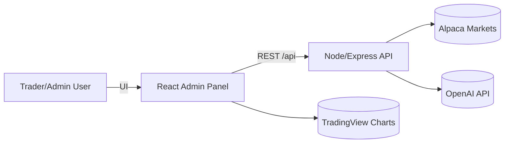
```mermaid
flowchart LR
  User[Trader/Admin User] -->|UI| Frontend[React Admin Panel]
  Frontend -->|REST /api| Backend[Node/Express API]
  Backend --> Alpaca[(Alpaca Markets)]
  Backend --> OpenAI[(OpenAI API)]
  Frontend --> TradingView[(TradingView Charts)]
```

[Back to top](#navigation)

---

## 2. SYSTEM ARCHITECTURE

### 2.1 High-Level Architecture
- **Pattern**: Two-tier client-server, modular monolith (backend), SPA frontend
- **System boundaries**: Local frontend + backend; external integrations to Alpaca & OpenAI
- **Communication**: REST (sync), cron scheduling (async), API polling for scan progress

#### C4 Context Diagram
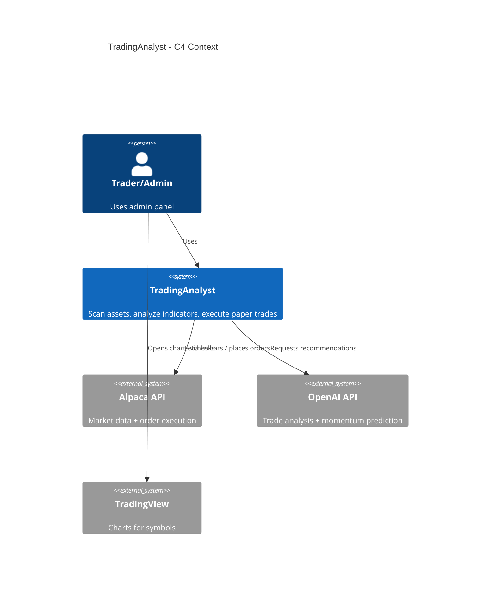
```mermaid
C4Context
title TradingAnalyst - C4 Context
Person(user, "Trader/Admin", "Uses admin panel")
System(tradingAnalyst, "TradingAnalyst", "Scan assets, analyze indicators, execute paper trades")
System_Ext(alpaca, "Alpaca API", "Market data + order execution")
System_Ext(openai, "OpenAI API", "Trade analysis + momentum prediction")
System_Ext(tv, "TradingView", "Charts for symbols")
Rel(user, tradingAnalyst, "Uses")
Rel(tradingAnalyst, alpaca, "Fetches bars / places orders")
Rel(tradingAnalyst, openai, "Requests recommendations")
Rel(user, tv, "Opens charts via links")
```

#### C4 Container Diagram
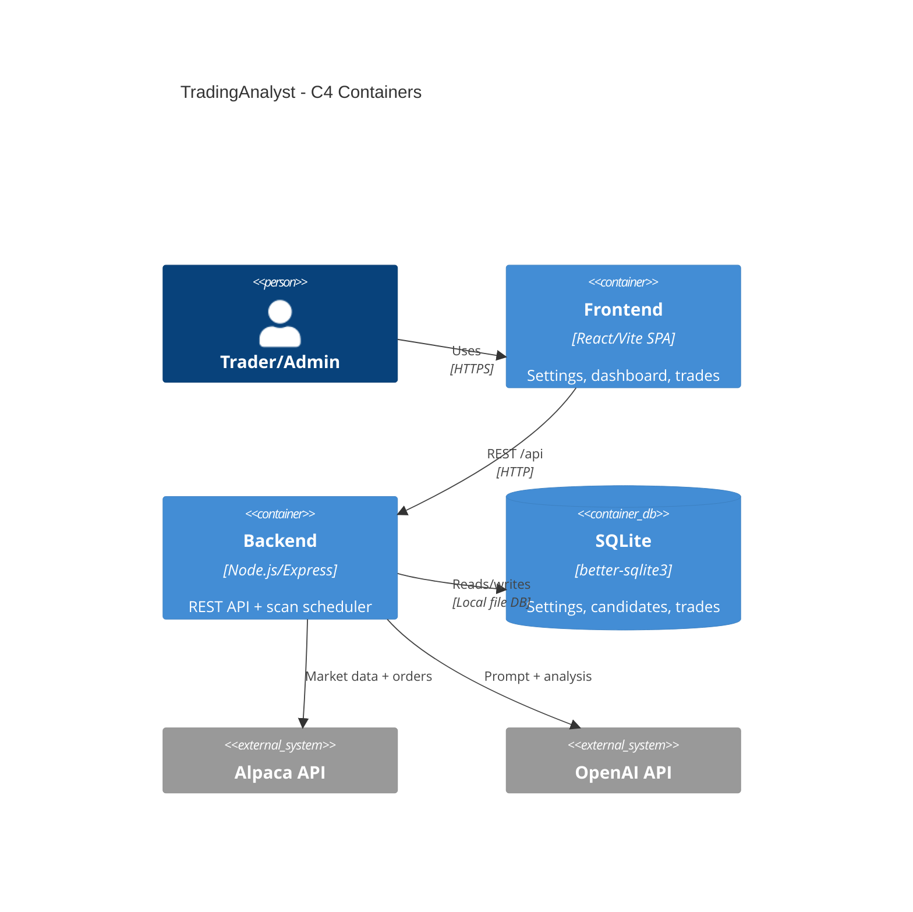
```mermaid
C4Container
title TradingAnalyst - C4 Containers
Person(user, "Trader/Admin")
Container(frontend, "Frontend", "React/Vite SPA", "Settings, dashboard, trades")
Container(backend, "Backend", "Node.js/Express", "REST API + scan scheduler")
ContainerDb(sqlite, "SQLite", "better-sqlite3", "Settings, candidates, trades")
System_Ext(alpaca, "Alpaca API")
System_Ext(openai, "OpenAI API")
Rel(user, frontend, "Uses", "HTTPS")
Rel(frontend, backend, "REST /api", "HTTP")
Rel(backend, sqlite, "Reads/writes", "Local file DB")
Rel(backend, alpaca, "Market data + orders")
Rel(backend, openai, "Prompt + analysis")
```

#### Component Diagram
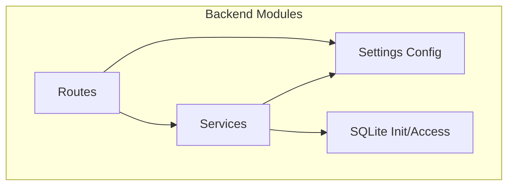
```mermaid
flowchart TB
  subgraph Backend[Backend Modules]
    Routes[Routes]
    Services[Services]
    Config[Settings Config]
    DB[SQLite Init/Access]
  end
  Routes --> Services
  Routes --> Config
  Services --> DB
  Services --> Config
```

### 2.2 Architecture Decision Records (ADRs)
- **ADR-001: Session-only trades**: trades table cleared on startup to keep POC state ephemeral (trade persistence not required).
- **ADR-002: Pre-qualification gate**: OpenAI called only when indicators show strong confluence to reduce cost/rate limit risk.
- **ADR-003: Crypto data only**: crypto symbols allowed for scan/data, but execution restricted to stocks.
- **ADR-004: Local-only admin**: no authentication/authorization to keep POC simple.
- **ADR-005: SQLite embedded DB**: avoids external DB dependencies for local run.

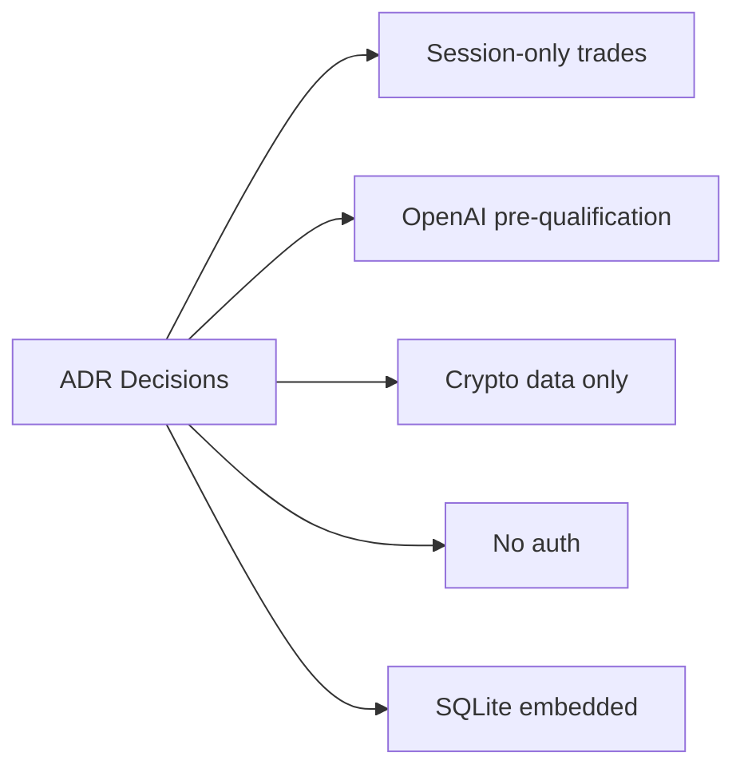
```mermaid
flowchart LR
  ADR[ADR Decisions] --> A[Session-only trades]
  ADR --> B[OpenAI pre-qualification]
  ADR --> C[Crypto data only]
  ADR --> D[No auth]
  ADR --> E[SQLite embedded]
```

[Back to top](#navigation)

---

## 3. TECHNOLOGY STACK

### 3.1 Complete Stack Inventory

| Layer | Technology | Version | Purpose |
|-------|------------|---------|---------|
| Language | JavaScript (ESM) | Node 18+ | Backend & frontend runtime |
| Backend Framework | Express | ^4.21.1 | REST API |
| Frontend Framework | React | ^18.3.1 | SPA UI |
| Routing | react-router-dom | ^6.28.0 | SPA routing |
| Build Tool | Vite | ^5.4.10 | Frontend dev/build |
| Build Tool | npm | (bundled) | Package manager |
| Database | SQLite | (local file) | Settings, candidates, trades |
| DB Driver | better-sqlite3 | ^11.6.0 | SQLite access |
| Scheduling | node-cron | ^3.0.3 | Scan scheduler |
| External SDK | @alpacahq/alpaca-trade-api | ^3.0.4 | Alpaca trading API |
| External SDK | openai | ^4.73.0 | OpenAI API |
| Middleware | cors | ^2.8.5 | CORS support |
| Config | dotenv | ^16.4.5 | Env loading |
| Observability | console logging | N/A | Basic logs |
| Testing | None | N/A | No test suite found |
| CI/CD | None | N/A | Not configured |
| Security | Env-based API keys | N/A | Secrets via `.env` |

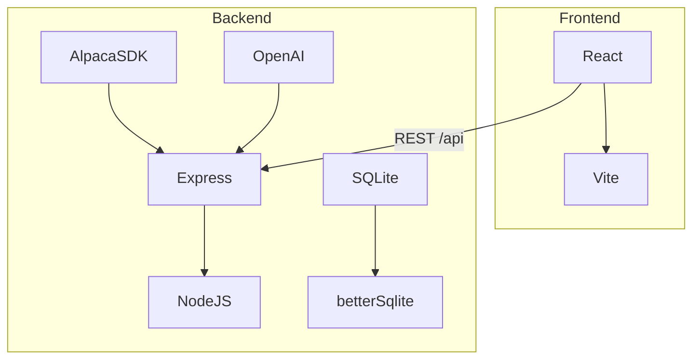
```mermaid
flowchart TB
  subgraph Frontend
    React --> Vite
  end
  subgraph Backend
    Express --> NodeJS
    SQLite --> betterSqlite
    AlpacaSDK --> Express
    OpenAI --> Express
  end
  React -->|REST /api| Express
```

[Back to top](#navigation)

---

## 4. BACKEND ARCHITECTURE

### 4.1 Application Entry Points
- Entry: `App/Backend/src/index.js:1`
- Boot sequence: load env, create Express app, init DB, start scheduler, mount routes, start server

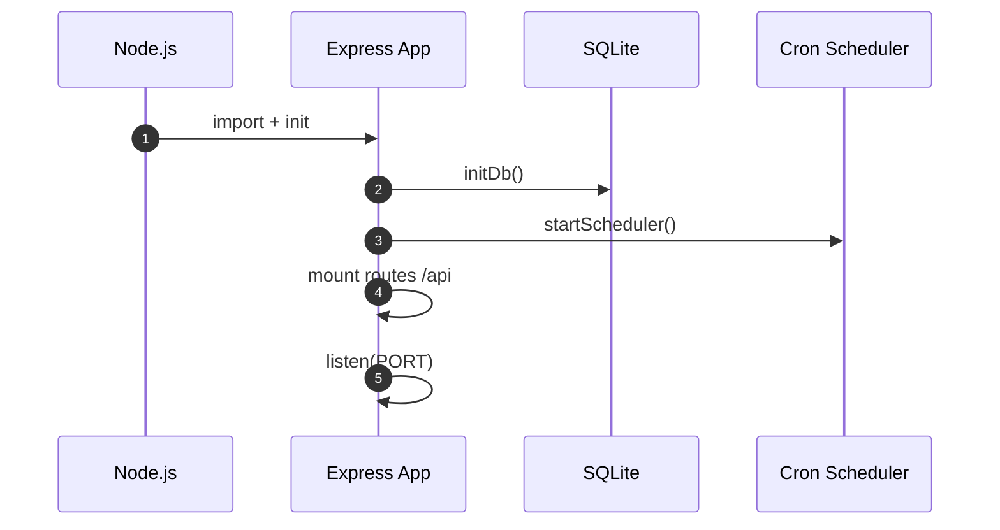
```mermaid
sequenceDiagram
  autonumber
  participant Node as Node.js
  participant App as Express App
  participant DB as SQLite
  participant Sched as Cron Scheduler
  Node->>App: import + init
  App->>DB: initDb()
  App->>Sched: startScheduler()
  App->>App: mount routes /api
  App->>App: listen(PORT)
```

**Bootstrap snippet (line-numbered):**
```js
1 import 'dotenv/config';
2 import express from 'express';
3 import cors from 'cors';
4 import { initDb } from './db/init.js';
5 import { startScheduler } from './services/scheduler.js';
6 const app = express();
7 app.use(cors());
8 app.use(express.json());
9 initDb();
10 startScheduler();
11 app.listen(PORT);
```

### 4.2 Server Configuration
- Server: Express over Node.js
- Port: `PORT` env or `3001` default
- Threading: Node event loop (no explicit pool)
- CORS: open via `cors()` default
- TLS: none (local dev only)

### 4.3 Package/Module Structure
- `routes/` thin controllers for API endpoints
- `services/` business logic (scan, strategy, OpenAI, Alpaca)
- `config/` runtime settings storage + validation
- `db/` SQLite initialization and connection

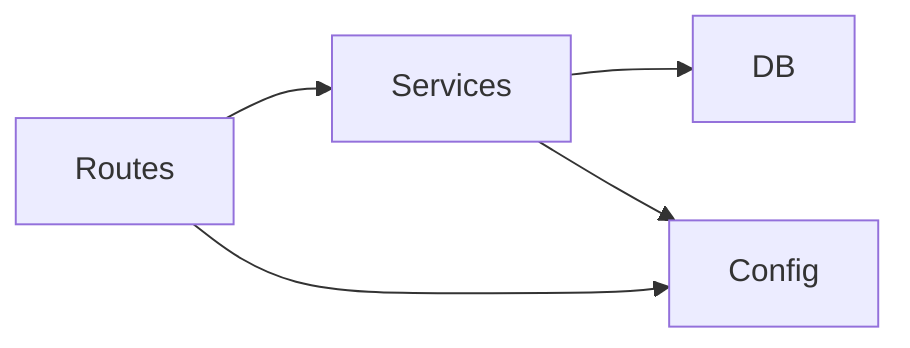
```mermaid
flowchart LR
  Routes --> Services
  Routes --> Config
  Services --> DB
  Services --> Config
```

### 4.4 Dependency Injection & Bean Configuration
- No DI container; uses ES module imports and singleton service patterns
- Singletons: Alpaca client, OpenAI client, in-memory caches
- Config: `.env` + SQLite-based settings

[Back to top](#navigation)

---

## 5. CONFIGURATION MANAGEMENT

### 5.1 Configuration Sources
- `.env` (API keys, ports)
- SQLite settings table (app runtime configs)
- Default settings in `config/settings.js`
- No external config server or feature flag system

### 5.2 Configuration Classes
- `getSettings()` merges defaults + persisted settings
- `updateSettings()` validates assets/timeframes, stores to SQLite
- `scanFrequencyCron` validated via `node-cron`

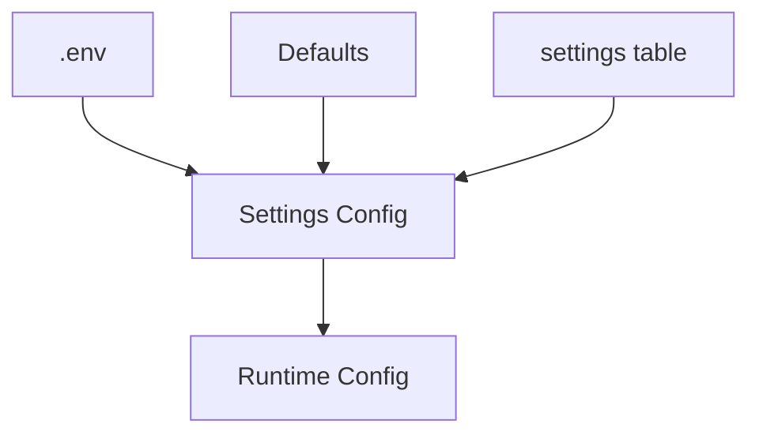
```mermaid
flowchart TB
  Env[.env] --> Settings[Settings Config]
  Defaults[Defaults] --> Settings
  SQLite[settings table] --> Settings
  Settings --> App[Runtime Config]
```

[Back to top](#navigation)

---

## 6. DATABASE LAYER

### 6.1 Database Architecture
- Database: SQLite file `App/Backend/data/trading.db` (created at runtime)
- Driver: `better-sqlite3`
- Connection pooling: none (in-process)
- Multi-DB: no

### 6.2 Schema Design
Tables:

**settings**
- key (TEXT, PK)
- value (TEXT)

**trades**
- id (INTEGER PK)
- symbol, side, quantity, entry_price, entry_time, stop_loss, take_profit
- exit_price, exit_time, exit_reason, pnl
- alpaca_order_id, timeframe
- created_at (default datetime now)

**candidates**
- id (INTEGER PK)
- symbol, timeframe, side, confidence, suggested_size
- stop_loss, take_profit, raw_response, rsi
- bravo9_signal, bravo9, current_price
- trend_signal, trend_200, macd_signal
- momentum_prediction, scanned_at

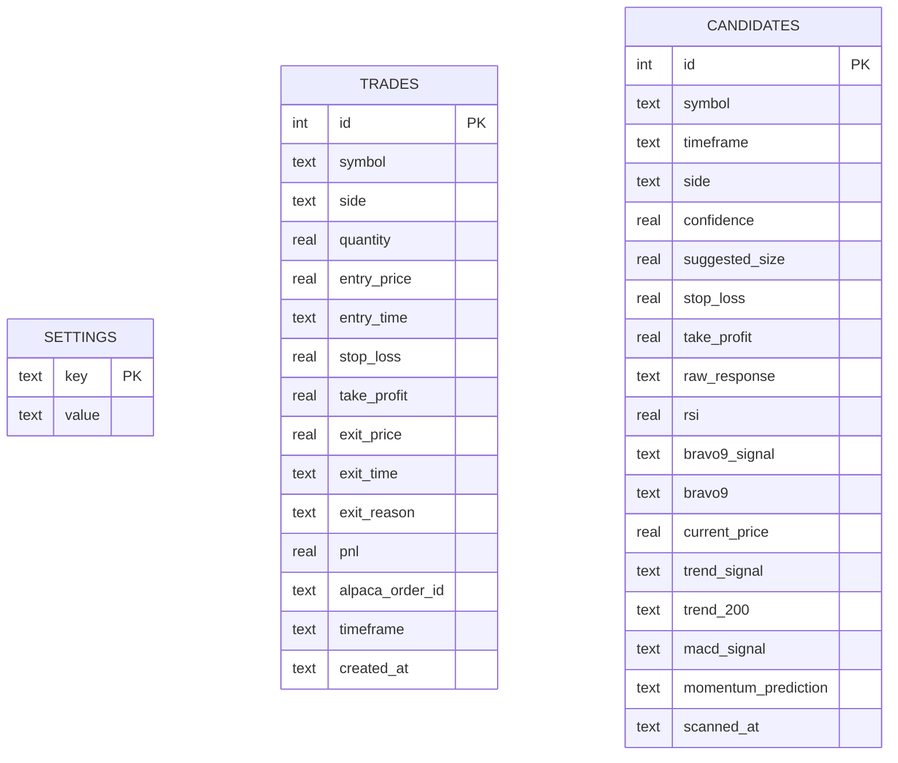
```mermaid
erDiagram
  SETTINGS {
    text key PK
    text value
  }
  TRADES {
    int id PK
    text symbol
    text side
    real quantity
    real entry_price
    text entry_time
    real stop_loss
    real take_profit
    real exit_price
    text exit_time
    text exit_reason
    real pnl
    text alpaca_order_id
    text timeframe
    text created_at
  }
  CANDIDATES {
    int id PK
    text symbol
    text timeframe
    text side
    real confidence
    real suggested_size
    real stop_loss
    real take_profit
    text raw_response
    real rsi
    text bravo9_signal
    text bravo9
    real current_price
    text trend_signal
    text trend_200
    text macd_signal
    text momentum_prediction
    text scanned_at
  }
```

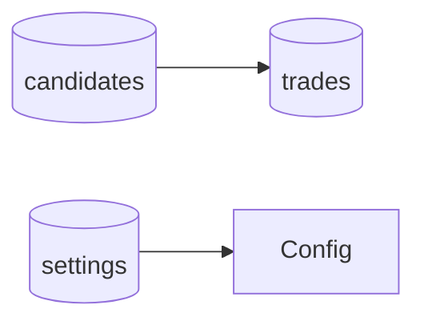
```mermaid
flowchart LR
  Candidates[(candidates)] --> Trades[(trades)]
  Settings[(settings)] --> Backend[Config]
```

### 6.3 Data Access Layer
- ORM: none (raw SQL via better-sqlite3)
- Repository pattern: implicit in route/service functions
- Queries: prepared statements in routes and services
- No lazy/eager configuration (manual SQL)

### 6.4 Database Migration
- Migration model: `ALTER TABLE` checks in `db/init.js`
- No Flyway/Liquibase
- Rollbacks: manual (not implemented)

### 6.5 Caching Strategy
- In-memory cache for Alpaca asset list (TTL 24h)
- Scan progress stored in memory for UI polling

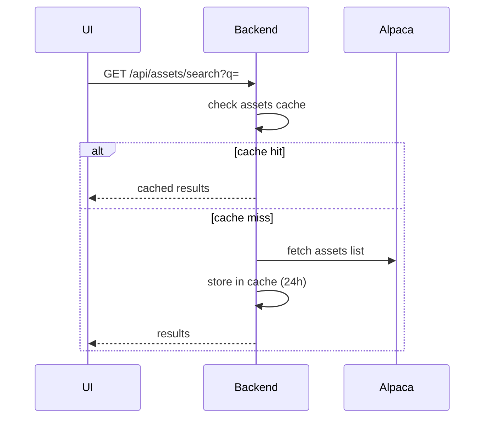
```mermaid
sequenceDiagram
  participant UI
  participant Backend
  participant Alpaca
  UI->>Backend: GET /api/assets/search?q=
  Backend->>Backend: check assets cache
  alt cache hit
    Backend-->>UI: cached results
  else cache miss
    Backend->>Alpaca: fetch assets list
    Backend->>Backend: store in cache (24h)
    Backend-->>UI: results
  end
```

[Back to top](#navigation)

---

## 7. API LAYER

### 7.1 API Design
- Style: REST
- Versioning: none (single v1)
- Base path: `/api`
- Conventions: JSON request/response

### 7.2 Complete API Reference

**Settings**
- `GET /api/settings`  
  Response: settings object `{ assets[], timeframes[], schedulerEnabled, scanFrequencyCron, strategy, openai }`
- `PUT /api/settings`  
  Body: settings object (same shape)  
  Response: updated settings
- `GET /api/settings/openai-models`  
  Response: `{ models: [{ id, created, owned_by }] }`

**Scan**
- `POST /api/scan/run?indicatorOnly=true|false`  
  Body: `{ indicatorOnly?: boolean }`  
  Response (default): `{ candidates[], scannedAt }`  
  Response (indicatorOnly): `{ indicatorsOnly[], scannedAt }`
- `GET /api/scan/progress`  
  Response: `{ running, indicatorOnly, current, total, symbol, timeframe }`
- `GET /api/scan/candidates`  
  Response: `{ candidates[], lastScannedAt }`
- `POST /api/scan/execute`  
  Body: `{ symbol, side, quantity, orderType, limitPrice?, stopLoss?, takeProfit?, timeframe? }`  
  Response: `{ order, trade }`

**Trades**
- `GET /api/trades?symbol&limit`  
  Response: `Trade[]`
- `GET /api/trades/stats`  
  Response: `{ totalTrades, wins, losses, winRate, totalPnl, avgWin, avgLoss }`
- `POST /api/trades`  
  Body: `{ symbol, side, quantity, entry_price?, entry_time?, stop_loss?, take_profit?, alpaca_order_id?, timeframe? }`  
  Response: created trade
- `PATCH /api/trades/:id`  
  Body: `{ exit_price?, exit_time?, exit_reason?, pnl? }`  
  Response: updated trade

**Assets**
- `GET /api/assets/search?q=`  
  Response: `[{ symbol, name, asset_class }]`

**Health**
- `GET /api/health`  
  Response: `{ ok: true }`

```mermaid
flowchart TB
  API[/api] --> Settings[/settings]
  API --> Scan[/scan]
  API --> Trades[/trades]
  API --> Assets[/assets]
  API --> Health[/health]
```

### 7.3 Request/Response Flow
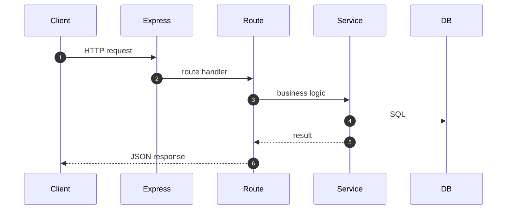
```mermaid
sequenceDiagram
  autonumber
  participant Client
  participant Express
  participant Route
  participant Service
  participant DB
  Client->>Express: HTTP request
  Express->>Route: route handler
  Route->>Service: business logic
  Service->>DB: SQL
  Service-->>Route: result
  Route-->>Client: JSON response
```

### 7.4 API Documentation
- No OpenAPI/Swagger configured
- Recommendation: add OpenAPI for production

### 7.5 Error Handling
- Per-route try/catch returning `{ error: message }`
- Global Express error middleware
- Custom handling for order validation and Alpaca errors

[Back to top](#navigation)

---

## 8. SERVICES LAYER

### 8.1 Service Architecture
- `scan.js`: orchestration, state, DB writes
- `strategy.js`: pure indicator calculations
- `openai.js`: prompt generation + JSON parsing
- `alpaca.js`: data retrieval + trade execution
- `scheduler.js`: cron trigger + market-open check

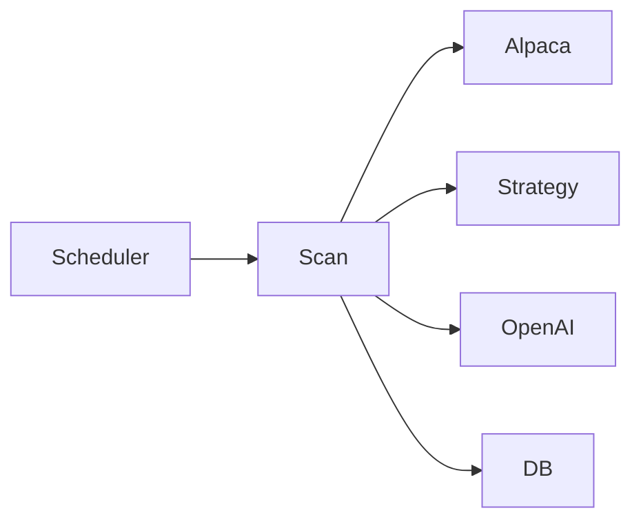
```mermaid
flowchart LR
  Scan --> Alpaca
  Scan --> Strategy
  Scan --> OpenAI
  Scan --> DB
  Scheduler --> Scan
```

### 8.2 Transaction Management
- No explicit transactions (`better-sqlite3` supports but not used)
- Atomic inserts per operation

### 8.3 Business Logic Components
- **Scan Service**: iterates assets/timeframes, computes indicators, calls OpenAI, inserts candidates
- **Strategy Service**: MA/EMA/RSI/MACD/Bravo 9 + confluence checks
- **OpenAI Service**: builds prompt from indicators + bars, parses JSON response
- **Alpaca Service**: market data, latest trade price, and order placement
- **Scheduler**: cron + market open gating via Alpaca clock

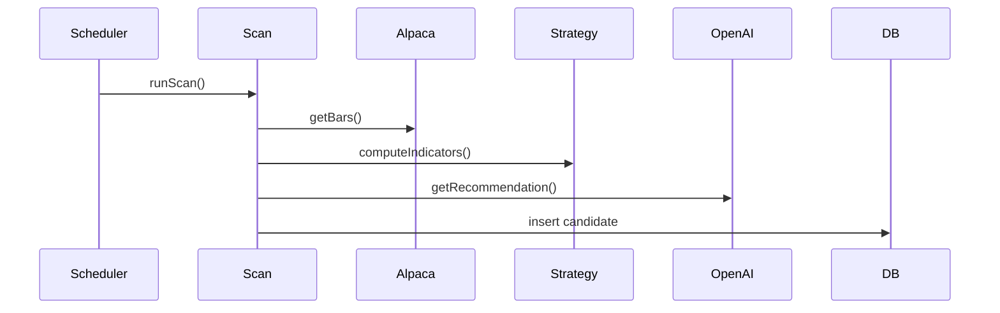
```mermaid
sequenceDiagram
  participant Scheduler
  participant Scan
  participant Alpaca
  participant Strategy
  participant OpenAI
  participant DB
  Scheduler->>Scan: runScan()
  Scan->>Alpaca: getBars()
  Scan->>Strategy: computeIndicators()
  Scan->>OpenAI: getRecommendation()
  Scan->>DB: insert candidate
```

### 8.4 Domain Model
- **Entities**: Trade, Candidate, Settings
- **Value Objects**: Indicators (RSI, MACD, Trend, Bravo9)
- **Aggregates**: Scan results per asset/timeframe
- **Domain events**: implicit (scan completed, trade executed)

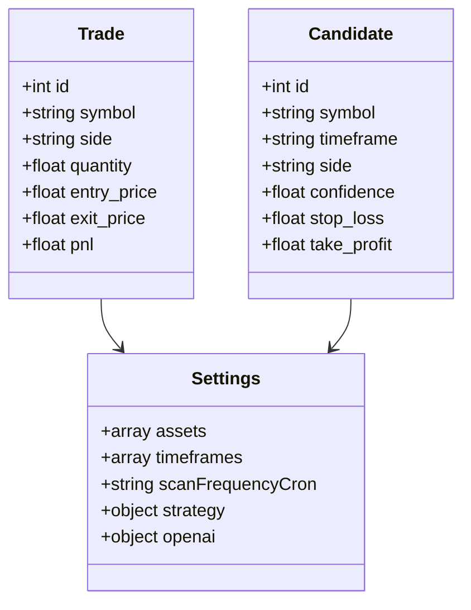
```mermaid
classDiagram
  class Trade {
    +int id
    +string symbol
    +string side
    +float quantity
    +float entry_price
    +float exit_price
    +float pnl
  }
  class Candidate {
    +int id
    +string symbol
    +string timeframe
    +string side
    +float confidence
    +float stop_loss
    +float take_profit
  }
  class Settings {
    +array assets
    +array timeframes
    +string scanFrequencyCron
    +object strategy
    +object openai
  }
  Trade --> Settings
  Candidate --> Settings
```

[Back to top](#navigation)

---

## 9. INTEGRATION LAYER

### 9.1 External Service Integrations
- **Alpaca**: REST API for market data & orders
- **OpenAI**: chat completion API
- Patterns: retry with backoff on 429; no circuit breaker

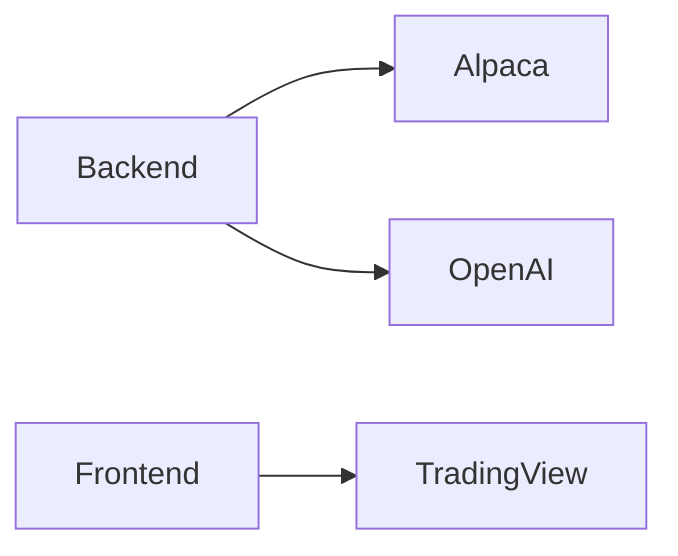
```mermaid
flowchart LR
  Backend --> Alpaca
  Backend --> OpenAI
  Frontend --> TradingView
```

### 9.2 Messaging & Events
- No message broker
- No async event bus

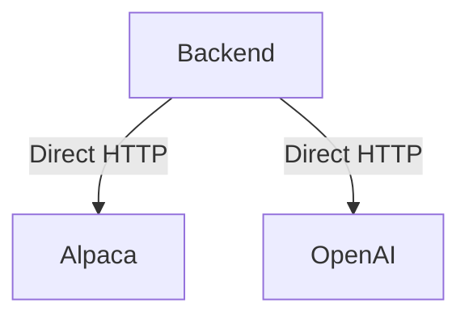
```mermaid
flowchart TB
  Backend -->|Direct HTTP| Alpaca
  Backend -->|Direct HTTP| OpenAI
```

### 9.3 Async Processing
- `node-cron` scheduled scans
- `setInterval` polling for scan progress (frontend)
- `sleep()` delays for rate limiting

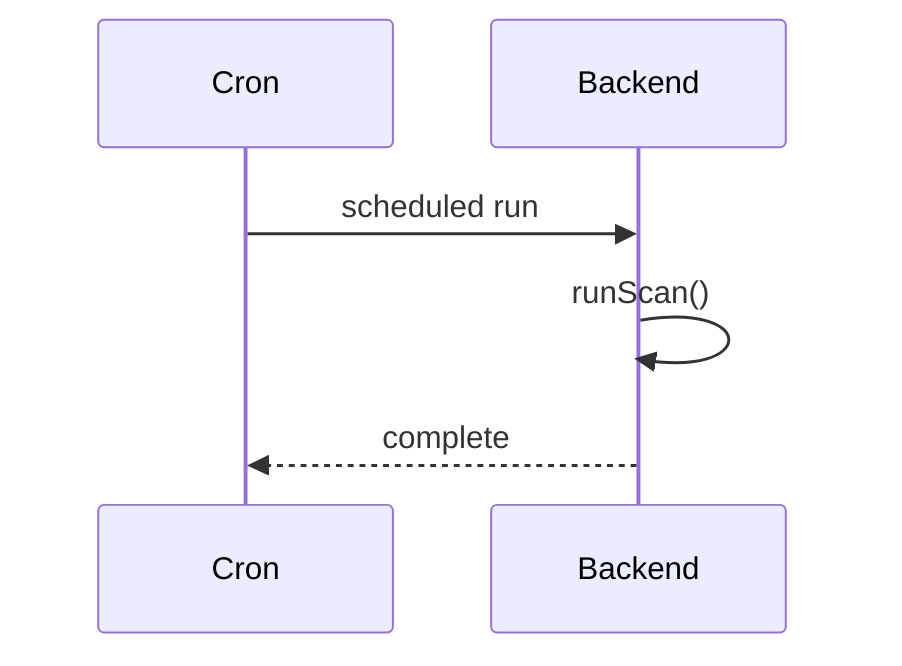
```mermaid
sequenceDiagram
  participant Cron
  participant Backend
  Cron->>Backend: scheduled run
  Backend->>Backend: runScan()
  Backend-->>Cron: complete
```

[Back to top](#navigation)

---

## 10. SECURITY ARCHITECTURE

### 10.1 Authentication
- **None** (local POC)
- API keys via `.env` for Alpaca/OpenAI only

```mermaid
sequenceDiagram
  participant User
  participant UI
  participant API
  User->>UI: open admin panel
  UI->>API: call /api/* (no auth)
  API-->>UI: responses
```

### 10.2 Authorization
- None implemented (all endpoints open)

```mermaid
flowchart LR
  Request --> API --> Response
```

### 10.3 Security Configuration
- CORS enabled (open)
- No CSRF/XSS protection
- Secrets loaded from environment
- No token/session management

[Back to top](#navigation)

---

## 11. FRONTEND ARCHITECTURE

### 11.1 Frontend Overview
- Framework: React 18 + Vite
- Router: react-router-dom
- State: local state hooks (`useState`, `useMemo`, `useCallback`)
- Styling: global CSS (`index.css`)

```mermaid
flowchart TB
  App --> Dashboard
  App --> Settings
  App --> Trades
```

### 11.2 Project Structure
- `pages/`: route-level views
- `components/`: shared UI
- `api/`: REST client
- `utils/`: helpers (TradingView URL)

### 11.3 Component Architecture
```mermaid
flowchart TB
  Layout --> App
  App --> Dashboard
  App --> Settings
  App --> Trades
  Dashboard --> ExecuteModal
```

### 11.4 Pages & Routing
- `/` → Dashboard
- `/settings` → Settings
- `/trades` → Trades

```mermaid
flowchart LR
  "/" --> Dashboard
  "/settings" --> Settings
  "/trades" --> Trades
```

### 11.5 State Management
- Local component state; no Redux/MobX
- Effects for API calls and polling

```mermaid
sequenceDiagram
  participant UI
  participant API
  UI->>API: fetch settings/candidates/trades
  API-->>UI: JSON
  UI->>UI: setState()
```

### 11.6 API Client Layer
- Centralized in `api/client.js`
- Fetch wrapper with JSON parsing and error throwing

### 11.7 Utilities & Helpers
- TradingView URL builder (`utils/tradingView.js`)

### 11.8 Styling Architecture
- Global CSS (`index.css`)
- Custom classes for layout, tables, and forms

[Back to top](#navigation)

---

## 12. KEY WORKFLOWS & USE CASES

### 12.1 Critical Business Workflows

**Workflow A: Manual Scan**
- Actor: user
- Steps: click scan → backend runScan → candidates saved → UI updated
- Exceptions: Alpaca/OpenAI errors, rate limiting

```mermaid
sequenceDiagram
  participant User
  participant UI
  participant Backend
  participant Alpaca
  participant OpenAI
  User->>UI: click "Run scan"
  UI->>Backend: POST /api/scan/run
  Backend->>Alpaca: getBars()
  Backend->>OpenAI: getRecommendation()
  Backend-->>UI: candidates + scannedAt
```

**Workflow B: Execute Trade**
- Actor: user
- Steps: open modal → submit order → Alpaca order → trade logged
- Exceptions: validation error, Alpaca rejection

```mermaid
sequenceDiagram
  participant User
  participant UI
  participant Backend
  participant Alpaca
  User->>UI: execute candidate
  UI->>Backend: POST /api/scan/execute
  Backend->>Alpaca: createOrder()
  Backend-->>UI: order + trade
```

**State Machine (Trade lifecycle)**
```mermaid
stateDiagram-v2
  [*] --> Created
  Created --> Executed
  Executed --> Exited
  Exited --> [*]
```

### 12.2 Data Flow
```mermaid
flowchart LR
  AlpacaBars --> Indicators
  Indicators --> OpenAI
  OpenAI --> Candidates
  Candidates --> UI
  UI --> AlpacaOrders
  AlpacaOrders --> Trades
```

[Back to top](#navigation)

---

## 13. TESTING ARCHITECTURE

### 13.1 Testing Strategy
- No automated test suites found
- Manual validation via UI

### 13.2 Test Organization
- No `tests/` directories found

### 13.3 Test Configuration
- No test-specific configs or fixtures

```mermaid
flowchart TB
  Unit[Unit Tests]:::missing --> Integration[Integration Tests]:::missing --> E2E[E2E Tests]:::missing
  classDef missing fill:#333,stroke:#999,color:#ccc
```

[Back to top](#navigation)

---

## 14. LOGGING & OBSERVABILITY

### 14.1 Logging
- `console.log` and `console.error`
- OpenAI response logging enabled by default

### 14.2 Metrics
- None

### 14.3 Tracing
- None

### 14.4 Health Checks
- `/api/health` returns `{ ok: true }`

```mermaid
flowchart LR
  Backend --> Logs[Console Logs]
  Backend --> Health[/api/health]
```

[Back to top](#navigation)

---

## 15. DEPLOYMENT & DEVOPS

### 15.1 Build Process
- Backend: `npm start` (`App/Backend/package.json:1`)
- Frontend: `npm run dev` / `npm run build`

```mermaid
flowchart LR
  Source --> npmInstall --> Build
  Build --> Run
```

### 15.2 Containerization
- No Dockerfile or compose found

### 15.3 Orchestration
- No Kubernetes manifests found

### 15.4 CI/CD Pipeline
- No pipeline configs found

```mermaid
flowchart LR
  Commit --> ManualRun[Manual build/run]
```

### 15.5 Infrastructure
- Local dev only; no cloud resources defined

```mermaid
flowchart LR
  DeveloperPC --> Backend --> Frontend
```

[Back to top](#navigation)

---

## 16. PERFORMANCE CONSIDERATIONS

- Pre-qualification gate to reduce OpenAI calls
- Rate limiting: Alpaca and OpenAI retry with backoff
- Scan delay throttle via `ALPACA_DATA_DELAY_MS`
- In-memory cache for assets

```mermaid
flowchart LR
  Scan --> Throttle[Delay + Retry] --> ExternalAPIs
```

[Back to top](#navigation)

---

## 17. APPENDICES

### A. Glossary
- **Bravo 9**: EMA9/EMA20/SMA180 alignment reversal signal
- **Confluence**: Multiple indicators aligning for higher confidence
- **Candidate**: Recommended trade opportunity
- **IndicatorOnly**: Scan without OpenAI for quota safety

```mermaid
pie title Glossary Categories
  "Indicators" : 40
  "Trading" : 35
  "System" : 25
```

### B. References
- `App/ARCHITECTURE.md:1`
- `App/README.md:1`
- `roadmap.md:1` (project plan)

### C. Changelog
- Initial POC architecture
- Added OpenAI pre-qualification
- Added session-only trade persistence

```mermaid
gantt
dateFormat  YYYY-MM-DD
title Architecture Timeline (High-Level)
section POC
Initial POC           :done, 2026-02-01, 5d
OpenAI integration    :done, 2026-02-06, 3d
Scheduler + settings  :done, 2026-02-09, 3d
```

[Back to top](#navigation)
